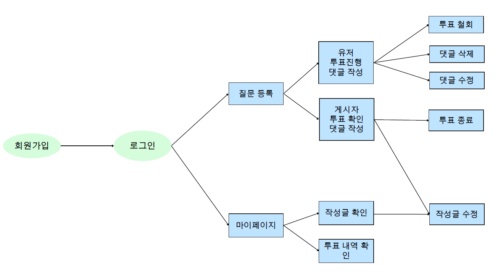
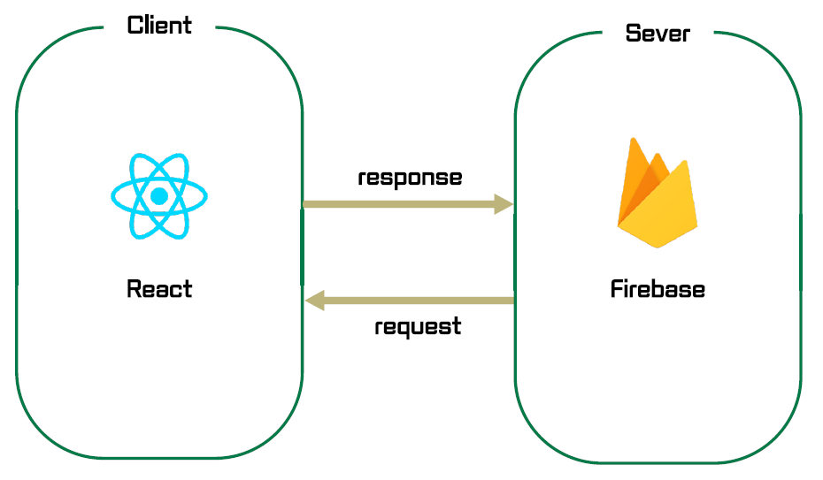

# A1.1 OSS 프로젝트 수행계획서

## 1. 프로젝트 수행팀 개요

* 수행 학기: 2024-1학기
* 프로젝트명: 
* 팀명: OneCOIN

구분 | 성명 | 학번 | 소속학과 | 연계전공 | 이메일
------|-------|-------|-------|-------|-------
팀장 | 최해관 | 2019110026 | 불교학부 | 융합SW연계전공 | kkhagwan@dongguk.edu         
팀원 | 송원종 | 2018110398 | 철학과 | 융합SW연계전공 | wjsong96@dgu.ac.kr       
팀원 | 이종주 | 2021112456 | 산업시스템공학과 | 융합SW연계전공 | tlzhsh2@dgu.ac.kr        

* 지도교수: (소속)      (성명) 이길섭    

## 2. 프로젝트 수행계획  

### 2.1 프로젝트 개요

* 선택한 주제에 대해 잘 이해하고 학생 팀의 아이디어를 포함하여 개략적인 설명을 해야한다.  
* 프로젝트의 주제는 무엇인지 대략적인 설명과 해당 주제를 선정하게 된 배경, 해당 프로젝트의 필요성 및 해결 방향 등을 간략히 소개한다.  
* 또한, 달성하고자 하는 목적과 설계하고자 하는 최종 결과가 무엇인지 분명히 드러나도록 상세하게 기술한다.  

### 2.2 추진 배경(자료조사 및 요구분석)  

#### (1) 개발 배경 및 필요성  

* 현대 사회에서 많은 사람들이 개인적인 고민을 내면화하거나 해결 방법을 찾지 못하는 경우가 많습니다. 기존의 상담 서비스는 대면이나 비용 문제로 접근성이 제한적일 수 있고 또한 가벼운 내용일 경우 다수의 의견이 빠르게 필요할 수 있습니다. 이러한 배경에서 저비용으로 손쉽게 접근할 수 있는 디지털 공간의 필요성이 대두되었습니다. 이 프로젝트는 사용자들이 온라인 공간에서 자신의 고민을 공유하고, 커뮤니티의 피드백을 통해 다양한 해결책을 모색할 수 있는 플랫폼을 제공합니다.
    

#### (2) 선행기술 및 사례 분석  

* 본 프로젝트의 선행 기술로는 유튜브의 커뮤니티 투표 기능과 인스타그램의 스토리 투표 기능을 들 수 있습니다.
* 유튜브 커뮤니티 투표는 사용자들이 채널에 대한 의견을 투표로 나타내게 하여 참여를 유도하고 댓글을 이용해 의견을 나눌 수 있는 기능입니다. 단, 일정 구독자 수 이상의 대형 유튜버들만 이 커뮤니티 기능을 이용할 수 있기에 모든 이가 사용하는데에 있어 제한 사항이 있습니다.
* 인스타그램의 스토리 투표는 실시간으로 피드백을 받을 수 있게 하는 짧은 설문 형태입니다. 주로 팔로워들을 대상으로 이루어지며 24시간 내의 시간 동안 투표를 받습니다. 즉각적인 확인이 가능하고 빠른 참여를 유도할 수 있지만, 이 투표에 대한 이야기와 토론을 투표자들끼리 나눌 수 없다는 문제가 있습니다.

구분 | 사용자 제한이 있는가 | 댓글 기능이 있는가 | 핫 게시물 기능이 있는가 | 마이 페이지 기능이 있는가  
------|-------|-------|-------|-------
유튜브 커뮤니티 | X | ◎ | ㅁ | ㅁ          
인스타그램 스토리 | ○ | X | ㅁ | ㅁ     
가제 | ◎ | ◎ | ㅁ | ㅁ

본 프로젝트에서는 이러한 선행 기술을 토대로 하여, 좀 더 구체적인 사용자의 개인적 고민을 중심으로 한 커뮤니티를 형성하고, 이를 통해 사용자 간의 공감과 지지를 구축하는 새로운 차원의 소셜 네트워크 서비스를 제안합니다. 사용자의 고민을 토대로 한 핫 게시물 기능은 커뮤니티의 가장 큰 관심사를 자동으로 강조하여, 더 많은 소통과 토론을 이끌어낼 수 있습니다.

### 2.3 목표 및 내용  

#### (1) 개발 목표  

<!-- *  구체적으로 개발하고자 하는 목표를 창의성, 난이도, 최종결과물의 완성도를 고려하여 정의한다.   -->
* 온라인 투표 커뮤니티 서비스로, 작성자의 질문을 모두가 공유하고 고민할 수 있는 웹앱을 만드는 것을 목표로합니다.
#### (2) 개발 내용  

* 개발의 범위 및 최종 결과물이 갖는 구성과 기능, 특징, 성능 수준 등을 설명한다.  
* 
  1. 사용자가 질문을 업로드 할 수 있는 기능
  2. 사용자가 다른 사용자들의 질문들에 투표할 수 있는 기능
  3. 게시글 검색 기능
  4. 게시글에 댓글을 달 수 있는 기능
  5. 자신이 작성한 글, 자신이 투표에 참여한 글을 확인할 수 있는 기능

* 최종 설계 결과물(개발하고자 하는 설계 결과물의 최종 목표)의 형태
  * 최종 예상 웹페이지 이미지
    
    
* 최종 설계 결과물의 시스템 구성과 기능, 특징 등  
    * 결과물의 대표 기능 및 하위 기능, 특징, 달성 수준을 나열
    - 대표기능
      - 고민글 작성 : 회원가입을 진행한 회원을 대상으로 고민글을 작성할 수 있도록 한다.
      - 투표 기능 : 회원가입을 진행한 회원을 대상으로 투표를 진행할 수 있도록 한다.
      - 댓글 기능 : 고민글에 대해서 댓글을통해 서로 소통을 하도록 한다.
      - 마이페이지 : 어떤 글을 작성했고 해당 글로 바로 이동할 수 있도록 한다.
    * 결과물의 전체적 행태 및 구성을 알 수 있는 블록다이어그램으로 표현
      
           
#### (3) 대안 도출 및 구현 계획  

* 최종 목표를 달성하기 위해 다양한 가능성과 대안을 고려하고 그 중 하나의 솔루션을 선택한다.
    * 투표목록을 몇 개를 만들것인가? 
      - 투표목록 2개로 설정한다 
        - 2개의 투표목록만 생성할 경우 다양한 고민을 해결하기 위해 여러목록을 작성해야 하므로 4~5개로 설정한다.
    * 중복투표를 어떻게 제거할 것인가?
        - 웹사이트를 이용하기위해 회원가입을 하도록한다. 
          - 중복투표의 문제가 발생가능하므로 투표&글작성 모두 회원가입을 한 후 진행한다.
* 선택된 설계문제의 해결방안(솔루션)과 최종 설계 결과물에 맞는 구현과 관련된 구체적인 계획을 서술한다.  
    * 주요 기능을 구현하기 위한 방법
    
    * 서비스를 기능 구현을 위한 데이터 정의 및 자료 구조 정의
    - 회원가입
      - 아이디
      - 이메일
      - 비밀번호
      - 닉네임
    - 투표
      - 게시자
      - 제목
      - 설명
      - 투표상태
      - 투표타입
    - 댓글
      - 투표id
      - 댓글 내용
      - 생성일자
      - 수정일자
    - 선택지
      - 선택지
      - 투표인원
      - 투표자id
    * 전체 알고리즘에 대한 플로 차트 

#### (4) 설계의 현실적 제한요소(제약조건)  

1. 비용 및 제품화 할 시 고려사항
투표 앱의 개발과 유지보수에는 서버 비용, 개발자 급여, 마케팅 비용 등이 포함됩니다. 앱이 대규모 데이터를 처리할 수 있도록 설계되어야 하며, 이는 고성능 서버와 보안 시스템에 대한 투자를 필요로 합니다. 또한, 사용자 경험을 우선시하는 인터페이스 설계는 추가적인 시간과 자원을 요구합니다.

2. 동작환경에 대한 명확한 제약요건
앱은 다양한 기기와 운영체제에서 원활하게 작동해야 합니다. 모바일과 데스크톱 플랫폼 모두를 지원하는 반응형 디자인이 필요하며, 이는 테스트와 최적화를 위한 추가적인 자원을 필요로 합니다. 

3. 개발환경에 대한 명확한 제약요건
앱 개발은 최신 프로그래밍 언어와 프레임워크를 활용하여 이루어질 예정이지만, 테스팅 과정에 트래픽이 예상되지 않기 때문에

4. 사회성: 사회적 / 환경적 영향, 건강 / 안전 문제, 법적 제약, 윤리적 문제
사회적 인식과 법적 요구사항에 따라 개인정보 보호와 데이터 보안이 중요한 고려 사항입니다. 사용자 데이터를 안전하게 관리하고 법적으로 보호받을 수 있도록 설계해야 합니다. 또한, 이 앱이 사회적으로 긍정적인 영향을 미치도록 윤리적 지침을 설정하고 준수해야 합니다. 이를 위해서 비속어, 차별, 혐오 등과 같은 주제가 다루어질 수 없도록 정규식과 필터링, 제제등을 강하게 적용해야 합니다.

#### (5) 개발 환경  

* 최종 설계 결과물의 구현 수단
    * 개발환경: macOS, Window, Linux  
    * 개발환경: VScode, javascript, java  
※ 충분한 분량으로 개발환경에 대하여 상세하게 작성한다. 

### 2.4  기대효과  

1. 민주적 의사결정 증진
이 프로젝트는 불특정 다수가 참여할 수 있는 개방형 플랫폼으로 설계되어, 모든 사용자에게 의사 표현의 기회를 제공합니다. 유튜브와 같은 플랫폼에서 제한된 사용자만 접근할 수 있는 설문 기능과 달리, 이 앱은 누구나 쉽게 자신의 의견을 공유하고 다양한 주제에 대한 투표를 할 수 있게 함으로써 보다 폭넓은 참여를 유도합니다.
2. 효율적 의견 수집
이 앱은 설문조사를 주 기능으로 삼기 때문에 사용자 인터페이스(UI)가 매우 직관적이고 사용하기 쉽습니다. 사용자는 복잡한 기능 없이 원하는 설문을 빠르게 생성하고 공유할 수 있으며, 이를 통해 신속하고 효과적으로 대규모 데이터를 수집할 수 있습니다.
3. 경제적 이점
불특정 다수의 의견이 필요한 기업은 이 앱을 통해 시장 조사와 고객 의견 수집을 손쉽게 할 수 있습니다. 특히, 신제품 개발이나 서비스 개선에 앞서 고객의 니즈와 선호를 파악하는 데 큰 도움이 될 것입니다.
4. 사회적 상호 작용 증진
다양한 주제와 질문으로 사람들을 끌어들임으로써, 사용자 간의 상호 작용이 자연스럽게 증가합니다. 이는 사용자들이 서로 의견을 공유하고 토론하는 건강한 커뮤니케이션 환경을 조성하며, 사회적 연결감을 강화하는 데 기여할 수 있습니다.
### 2.5  추진일정  

* 세부 작업에 대한 간트챠트(링크 추가 예정)
* 세부 작업 별 구성원의 역할  

### 2.7 성과창출 계획  

항목 | 세부내용 | 예상(달성)시기  
------|------------|-------
Github 등록 |최종 소스코드 |24년 6월 초 예상 
논문게재 및 참가 | 저널 또는 학회명:            |  
SW등록 |        | 
특허출원 |        |      
시제품 |        | 

* 모바일 시제품은` 앱스토어` 또는 `구글플레이어`에 등록한다.

