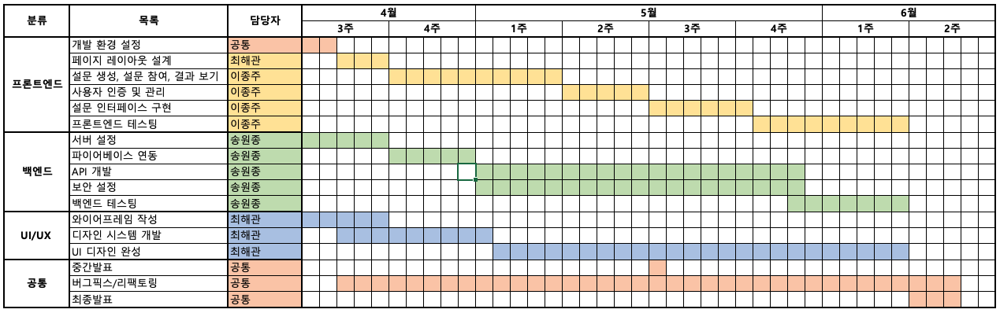

# A1.1 OSS 프로젝트 수행계획서

## 1. 프로젝트 수행팀 개요

* 수행 학기: 2024-1학기
* 프로젝트명: 민심캐치
* 팀명: OneCOIN

구분 | 성명 | 학번 | 소속학과 | 연계전공 | 이메일
------|-------|-------|-------|-------|-------
팀장 | 최해관 | 2019110026 | 불교학부 | 융합SW연계전공 | kkhagwan@dongguk.edu         
팀원 | 송원종 | 2018110398 | 철학과 | 융합SW연계전공 | wjsong96@dgu.ac.kr       
팀원 | 이종주 | 2021112456 | 산업시스템공학과 | 융합SW연계전공 | tlzhsh2@dgu.ac.kr        

* 지도교수: SW융합교육원 이길섭, 박효순   

## 2. 프로젝트 수행계획  

### 2.1 프로젝트 개요

* 투표 기능을 기반으로 한 모바일 커뮤니티 웹 앱 입니다.  
* 소위 MZ세대로 분류되는 젊은 계층을 대상으로 온라인 공간에서 고민을 해결하고 소통을 유도하는 플랫폼입니다.  
* 온라인 공간을 통해 불특정 다수에게 조언을 받고 정서적 지지를 얻을 수 있는 공간을 만드는 것이 최종 목표입니다.  

### 2.2 추진 배경(자료조사 및 요구분석)  

#### (1) 개발 배경 및 필요성  

* 현대 사회에서 많은 사람들이 개인적인 고민을 내면화하거나 해결 방법을 찾지 못하는 경우가 많습니다. 기존의 상담 서비스는 대면이나 비용 문제로 접근성이 제한적일 수 있고 또한 가벼운 내용일 경우 다수의 의견이 빠르게 필요할 수 있습니다. 이러한 배경에서 저비용으로 손쉽게 접근할 수 있는 디지털 공간의 필요성이 대두되었습니다. 특히 MZ세대는 오프라인 공간보다 온라인 공간을 선호하며, 보다 더 많은 시간을 쏟는 것으로 알려져 있습니다. 이 프로젝트는 사용자들이 온라인 공간에서 자신의 고민을 공유하고, 커뮤니티의 피드백을 통해 다양한 해결책을 모색할 수 있는 플랫폼을 제공합니다.
    

#### (2) 선행기술 및 사례 분석  

* 본 프로젝트의 선행 기술로는 유튜브의 커뮤니티 투표 기능과 인스타그램의 스토리 투표 기능을 들 수 있습니다.
* 유튜브 커뮤니티 투표는 사용자들이 채널에 대한 의견을 투표로 나타내게 하여 참여를 유도하고 댓글을 이용해 의견을 나눌 수 있는 기능입니다.
  단, 일정 구독자 수 이상의 대형 유튜버들만 이 커뮤니티 기능을 이용할 수 있기에 일반인이 사용하는데에 있어 제한 사항이 있습니다.
* 인스타그램의 스토리 투표는 실시간으로 피드백을 받을 수 있게 하는 짧은 설문 형태입니다.
  주로 팔로워들을 대상으로 이루어지며 24시간 내의 시간 동안 투표를 받습니다. 즉각적인 확인이 가능하고 빠른 참여를 유도할 수 있지만, 이 투표에 대한 이야기와 토론을 투표자들끼리 
  나눌 수 없다는 문제가 있습니다.
  

구분 | 이용에 있어 제한 사항이 있는가? | 불특정 다수간의 소통이 이루어질 수 있는가? | 다양한 내용의 글에 참여 유도가 가능한가? | 투표가 주요 기능인가?  
------|-------|-------|-------|-------
유튜브 커뮤니티 | X | ○ | X | X          
인스타그램 스토리 | ○ | X | ○ | X     
민심캐치 | ◎ | ◎ | ◎ | ◎

* 본 프로젝트에서는 이러한 선행 기술을 토대로 하여, 좀 더 구체적인 벼운 주제들로 더욱 활발한 참여를 유도합니다.

2. 효율적 의견 수집  
간단하고 직관적인 사용자 인터페이스(UI)를 통해 사용자는 복잡한 절차 없이 원하는 설문을 신속하게 생성하고 공유할 수 있습니다. 이러한 접근성은 신속한 데이터 수집과 함께, 사용자 경험을 극대화합니다.

3. 사회적 상호 작용 증진  
다양한 주제와 질문을 통해 사용자들은 자연스럽게 서로 의견을 공유하고 토론하게 됩니다. 이는 건강한 커뮤니케이션 환경을 조성하고, 사회적 연결감을 강화하는데 기여하며, 특히 젊은 사용자들에게 매력적인 소통의 창구로서 자리잡을 것이라 생각합니다.
### 2.5  추진일정  

* 

### 2.7 성과창출 계획  

항목 | 세부내용 | 예상(달성)시기  
------|------------|-------
Github 등록 |최종 소스코드 |24년 6월 초 예상 
논문게재 및 참가 | 저널 또는 학회명:            |  
SW등록 |        | 
특허출원 |        |      
시제품 |        | 

* 모바일 시제품은` 앱스토어` 또는 `구글플레이어`에 등록한다.

