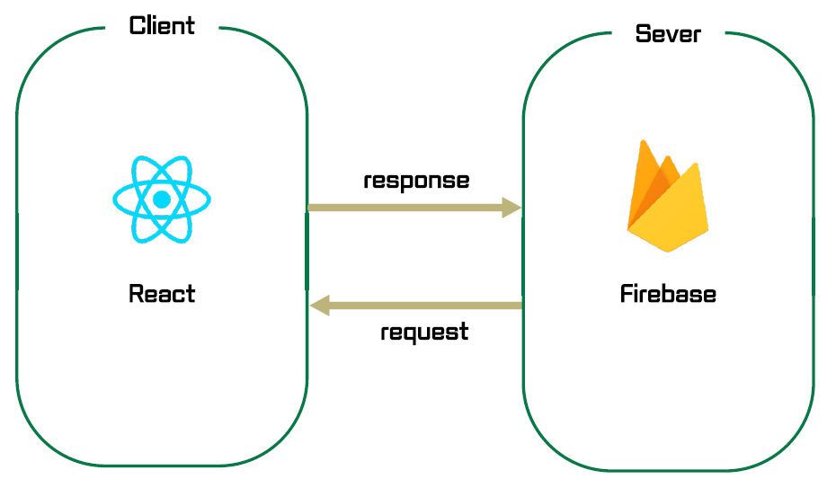

# A2.1 OSS 프로젝트 중간보고서

## 1. 프로젝트 수행팀 개요

* 수행 학기: 2024-1학기
* 프로젝트명: 민심캐치
* 팀명: OneCOIN

구분 | 성명 | 학번 | 소속학과 | 연계전공 | 이메일
------|-------|-------|-------|-------|-------
팀장 | 최해관 | 2019110026 | 불교학부 | 융합SW연계전공 | kkhagwan@dongguk.edu         
팀원 | 송원종 | 2018110398 | 철학과 | 융합SW연계전공 | wjsong96@dgu.ac.kr       
팀원 | 이종주 | 2021112456 | 산업시스템공학과 | 융합SW연계전공 | tlzhsh2@dgu.ac.kr        

* 지도교수: SW융합교육원 이길섭, 박효순  

## 2. 프로젝트 수행 내용  

### 2.1 프로젝트 개요

* 민심캐치는 MZ세대를 주요 대상으로 하는 모바일 커뮤니티 웹 앱으로, 사용자들이 온라인 공간에서 자신의 고민을 공유하고 다양한 해결 방안을 모색할 수 있는 플랫폼입니다. 이 서비스는 사용자가 투표를 통해 의견을 제시하고, 커뮤니티의 피드백을 받으며 서로 간의 공감과 정서적 지지를 얻을 수 있는 공간을 제공함으로써 온라인 상호작용을 증진시키는 것을 목표로 합니다.
프로젝트의 기본 아이디어는 사용자들이 자신의 고민이나 문제를 투표 형태로 제시하고, 다른 사용자들이 이에 투표하거나 댓글을 통해 조언을 주는 형식입니다. 이는 현대 사회에서 개인의 고민을 해결하는 데 필요한 빠른 피드백과 정서적 지지를 저비용으로 제공할 수 있는 방법을 모색하는 것입니다.
본 프로젝트는 이러한 디지털 공간의 필요성을 인식하고, 특히 오프라인보다 온라인 상호작용을 선호하는 젊은 세대에 맞춤형 서비스를 제공하기 위해 기획되었습니다.

### 2.2 추진 배경(자료조사 및 요구분석)  

#### (1) 개발 배경 및 필요성  

* 현대 사회에서 많은 사람들이 개인적인 고민을 내면화하거나 해결 방법을 찾지 못하는 경우가 많습니다. 기존의 상담 서비스는 대면이나 비용 문제로 접근성이 제한적일 수 있고 또한 가벼운 내용일 경우 다수의 의견이 빠르게 필요할 수 있습니다. 이러한 배경에서 저비용으로 손쉽게 접근할 수 있는 디지털 공간의 필요성이 대두되었습니다. 특히 MZ세대는 오프라인 공간보다 온라인 공간을 선호하며, 보다 더 많은 시간을 쏟는 것으로 알려져 있습니다. 이 프로젝트는 사용자들이 온라인 공간에서 자신의 고민을 공유하고, 커뮤니티의 피드백을 통해 다양한 해결책을 모색할 수 있는 플랫폼을 제공합니다.

#### (2) 선행기술 및 사례 분석  

* 본 프로젝트의 선행 기술로는 유튜브의 커뮤니티 투표 기능과 인스타그램의 스토리 투표 기능을 들 수 있습니다.
* 유튜브 커뮤니티 투표는 사용자들이 채널에 대한 의견을 투표로 나타내게 하여 참여를 유도하고 댓글을 이용해 의견을 나눌 수 있는 기능입니다.
  단, 일정 구독자 수 이상의 대형 유튜버들만 이 커뮤니티 기능을 이용할 수 있기에 일반인이 사용하는데에 있어 제한 사항이 있습니다.

  

* 인스타그램의 스토리 투표는 실시간으로 피드백을 받을 수 있게 하는 짧은 설문 형태입니다.
  주로 팔로워들을 대상으로 이루어지며 24시간 내의 시간 동안 투표를 받습니다. 즉각적인 확인이 가능하고 빠른 참여를 유도할 수 있지만, 이 투표에 대한 이야기와 토론을 투표자들끼리 
  나눌 수 없다는 문제가 있습니다.
   
  

구분 | 민심캐치 | 유튜브 | 인스타그램  
------|-------|-------|-------
누구나 사용 가능 | O | X | O 
불특정 다수와의 소통 | O | O | X      
일상적인 카테고리 | O | X | O 
빠르고 편한 투표 | O | △ | △  

* 본 프로젝트에서는 이러한 선행 기술을 토대로 하여, 좀 더 구체적이고 일상적인 개인적 고민을 중심으로 한 커뮤니티를 형성하고, 이를 통해 사용자 간의 공감과 지지를 구축하는 새로운 차원의 소셜 네트워크 서비스를 제안합니다. 기존의 선행 기술들이 해당 애플리케이션의 주요 기능이 아닌 부가 기능이기에 탑재되지 못했던 기능들을 구현하고, 보다 일상에 가까운 가벼운 주제들로 투표를 진행하며 소통하는 새로운 애플리케이션을 만들고자 합니다. 

### 2.3 목표 및 내용  

#### (1) 개발 목표  

<!-- *  구체적으로 개발하고자 하는 목표를 창의성, 난이도, 최종결과물의 완성도를 고려하여 정의한다.   -->
* 온라인 투표 커뮤니티 서비스로, 작성자의 질문을 모두가 공유하고 고민할 수 있는 웹앱을 만드는 것을 목표로합니다.

#### (2) 개발 내용  

* 
  - 사용자가 질문을 업로드 할 수 있는 기능
  - 사용자가 다른 사용자들의 질문들에 투표할 수 있는 기능
  - 게시글 검색 기능
  - 게시글에 댓글을 달 수 있는 기능
  - 자신이 작성한 글, 자신이 투표에 참여한 글을 확인할 수 있는 기능
  - 내 이름, 이메일을 수정할 수 있는 기능

* 최종 설계 결과물의 형태
  * 최종 예상 웹페이지 이미지
   
    

* 최종 설계 결과물의 시스템 구성과 기능, 특징  
    - 대표기능
      - 메인페이지 : 가장 최신의 글을 먼저 보여주고 스크롤을 통해 다음 글을 볼 수 있다.
      - 고민글 작성 : 로그인을 진행한 회원을 대상으로 고민글을 작성할 수 있도록 한다.
        - 고민글 제목 , 고민글 내용 , 투표 안건(최대 6개),카테고리 지정
      - 투표 기능 : 로그인을 진행한 회원을 대상으로 투표를 진행할 수 있도록 한다.
      - 댓글 기능 : 고민글에 대해서 댓글을 통해 서로 소통을 하도록 한다.
      - 마이페이지
        - 내가 참여한 투표 : 내가 어떤 글에 투표를 참여했는지 글 목록을 표시해준다.
        - 내가 작성한 질문 : 내가 어떤 글을 작성했는지 글 목록을 표시해준다.
        - 내정보 수정 : 나의 이름,이메일을 수정할 수 있다.
      - 검색기능 : 글의 제목을 검색할 수 있도록 기능
    * 결과물의 기능 및 순서를 나타낸 블록다이어그램
      
           
#### (3) 대안 도출 및 구현 계획  
  - 웹 개발 vs 안드로이드 개발
    - 안드로이드 스튜디오를 이용하여 안드로이드 어플을 개발할 경우 학교에서 배운 java를 활용하여 좀 더 쉬운 개발이 가능하고 배포 또한 google sotre를 통해 쉽게 배포가 가능함
    - 하지만 익명으로 다수의 사람들이 투표를 하고 그것으로 결정에 대한 도움을 받아야 하므로 이용자 수가 적을 경우 의사결정에 도움이 되지 않을 수 있기 때문에 웹 브라우저를 통해 어떤 기기로든지 접속할 수 있는 웹 개발이 더 어울릴 것이라고 판단 , 리액트를 통해 웹 개발을 하기로 결정
  - 백엔드 시스템으로 어떤 프레임워크를 사용할 것인가?
    - 처음에는 spring과 node.js같은 유명한 프로그램을 사용하기로 생각하고 그 중에서 팀원들이 모두 사용해본 spring을 이용하기로 결정함.
    - 하지만 , 4월 중순부터 본격적으로 팀과 모여서 회의를 진행했고 다른 사람이 만들어 놓은 프로그램을 이용하여 기능을 추가하는 개발이 아니라 처음부터 끝까지 모든 내용을 개발을 해야하는 입장이라 spring을 사용하면 mysql같은 것도 알아야 하므로 시간이 오래걸릴 것으로 생각됨
    - firebase는 frontend에서 모든 서버에 필요한 내용을 작성해서 데이터베이스까지 알아서 처리해주므로 개발기간이 단축될 것으로 생각하여 firebase를 사용하기로 결정함.
  - 투표목록을 몇 개를 만들것인가?
    - 투표목록 2개로 설정한다
      - 장점 : 빠르게 질문들을 올리고 해결하기위해 간단하게 2개로 제한해서 할 경우 질문하는 사람도 투표를 해주는 사람도 투표에 대한 제목과 투표 목록이 한 눈에 들어와 빠르게 투표가 가능하다
      - 단점 : 여러개의 질문이 존재할 경우 같은 제목을 가진 여러개의 글이 중복적으로 생성 될 수 있어 게시판이 지저분해 질 가능성이 존재
    - 투표 목록을 2개보다 많게 설정한다.
      - 장점 : 여러개의 투표 안건을 한번에 올릴 수 있어서 게시판의 글을 많이 올리지 않고도 고민을 빠르게 해결이 가능하다
      - 단점 : 만약에 질문이 2개이상 존재 하지 않는 경우 나머지 투표창이 다른 글로 채워질 가능성이 존재하고 투표 목록들이 쓰이지 않게 되는 경우가 생긴다.
    - 해결 방안 : 질문 작성자가 투표 안건의 개수를 정할 수 있도록 최소 2개~ 최대 6개까지 선택이 가능하도록 기능을 구현한다. 
    

    * 주요 기능을 구현하기 위한 방법
    
    * 데이터를 어떻게 주고 받는 지를 나타내는 시퀀스 다이어그램
    
    
  * 서비스를 기능 구현을 위한 데이터 정의 및 자료 구조 정의
    - 회원가입
      - 아이디
      - 이메일
      - 비밀번호
      - 닉네임
    - 투표
      - 게시자
      - 제목
      - 설명
      - 투표상태
      - 투표타입
    - 댓글
      - 투표id
      - 댓글 내용
      - 생성일자
      - 수정일자
    - 선택지
      - 선택지2~6
      - 투표 인원
      - 투표자id

#### (4) 설계의 현실적 제한요소(제약조건)  

1. 비용 및 제품화 할 시 고려사항
투표 앱의 개발과 유지보수에는 서버 비용, 개발자 급여, 마케팅 비용 등이 포함됩니다. 앱이 대규모 데이터를 처리할 수 있도록 설계되어야 하며, 이는 고성능 서버와 보안 시스템에 대한 투자를 필요로 합니다. 또한, 사용자 경험을 우선시하는 인터페이스 설계는 추가적인 시간과 자원을 요구합니다.

2. 동작환경에 대한 명확한 제약요건
앱은 다양한 기기와 운영체제에서 원활하게 작동해야 합니다. 모바일과 데스크톱 플랫폼 모두를 지원하는 반응형 디자인이 필요하며, 이는 테스트와 최적화를 위한 추가적인 자원을 필요로 합니다. 

3. 개발환경에 대한 명확한 제약요건
앱 개발은 최신 프로그래밍 언어와 프레임워크를 활용하여 이루어질 예정이지만, 테스팅 과정에서는 실제 구동시에 많은 트래픽으로 인해 발생할 여지가 있는 여러 문제사항들을 확인 할 수 없다는 제약이 있습니다. 이를 감안하고 테스팅 과정은 최대한 보수적으로 이루어져야 할 것 입니다.

4. 사회성: 사회적 / 환경적 영향, 건강 / 안전 문제, 법적 제약, 윤리적 문제
사회적 인식과 법적 요구사항에 따라 개인정보 보호와 데이터 보안이 중요한 고려 사항입니다. 사용자 데이터를 안전하게 관리하고 법적으로 보호받을 수 있도록 설계해야 합니다. 또한, 이 앱이 사회적으로 긍정적인 영향을 미치도록 윤리적 지침을 설정하고 준수해야 합니다. 이를 위해서 비속어, 차별, 혐오 등과 같은 주제가 다루어질 수 없도록 정규식과 필터링, 제제등을 강하게 적용해야 합니다.

#### (5) 개발 환경  

* 최종 설계 결과물의 구현 수단
    * 개발환경: macOS, Window, Linux  
    * 개발환경: VScode, javascript, java  
※ 충분한 분량으로 개발환경에 대하여 상세하게 작성한다.

### 2.4  기대효과  

1. 자유로운 플랫폼 제공
이 플랫폼은 모든 사용자가 자유롭게 의견을 표현하고 투표할 수 있는 개방형 공간을 제공합니다. 특히 젊은 사용자들이 자신의 의견을 쉽게 공유할 수 있게 하여, 주로 가볍운 주제들로 더욱 활발한 참여를 유도합니다.

2. 효율적 의견 수집  
간단하고 직관적인 사용자 인터페이스(UI)를 통해 사용자는 복잡한 절차 없이 원하는 설문을 신속하게 생성하고 공유할 수 있습니다. 이러한 접근성은 신속한 데이터 수집과 함께, 사용자 경험을 극대화합니다.

3. 사회적 상호 작용 증진  
다양한 주제와 질문을 통해 사용자들은 자연스럽게 서로 의견을 공유하고 토론하게 됩니다. 이는 건강한 커뮤니케이션 환경을 조성하고, 사회적 연결감을 강화하는데 기여하며, 특히 젊은 사용자들에게 매력적인 소통의 창구로서 자리잡을 것이라 생각합니다.

### 2.5  추진일정  

* 

### 2.6 팀원 역할  

구분 | 성명 | 팀내 역할 
:----:|:-----:|-------
팀장 | 홍길동 | ㅇㅇㅇㅇㅇㅇㅇㅇㅇㅇㅇㅇㅇㅇㅇㅇㅇㅇㅇㅇㅇㅇㅇ 
팀원 |        |         
팀원 |        |         

### 2.7 참고문헌  

1. 저자, 제목, 교과목, ㅇㅇ대학, 연월. 
2. 저자, 제목, 출판사, 연월.
3. 저자, 제목, 저널명, 권, 호, 연월, 페이지.
4. 저자, 제목, 사이트/블로그명, 링크, 연월.  

### 2.8 성과창출 계획  

항목 | 세부내용 | 예상(달성)시기  
------|------------|-------
Github 등록 |        | 
논문게재 및 참가 | 저널 또는 학회명:            |  
SW등록 |        | 
특허출원 |        |      
시제품 |        | 

* 모바일 시제품은` 앱스토어` 또는 `구글플레이어`에 등록한다.
