# A3.1 OSS 프로젝트 최종보고서

## I. 프로젝트 수행팀 개요

* 수행 학기:  2024-1학기
* 프로젝트명:  투표 커뮤니티 서비스 "민심캐치(MinsimCatch)"
* Key Words
    * 투표
    * 공감
    * 고민
    * 커뮤니티
    * 어떻게
* 팀명: OneCOIN

구분 | 성명 | 학번 | 소속학과 | 연계전공 | 이메일
------|-------|-------|-------|-------|-------
팀장 | 최해관 | 2019110026 | 불교학부 | 융합SW연계전공 | kkhagwan@dongguk.edu         
팀원 | 송원종 | 2018110398 | 철학과 | 융합SW연계전공 | wjsong96@dgu.ac.kr       
팀원 | 이종주 | 2021112456 | 산업시스템공학과 | 융합SW연계전공 | tlzhsh2@dgu.ac.kr   

* 지도교수: SW융합교육원 이길섭, 박효순       

## II. 프로젝트  수행 결과

### 1. 프로젝트 개요  

#### 1.1 개발 동기 및 목적  
- 고민 내면화와 디지털 공간의 필요성
  - 현대 사회에서 많은 사람들이 개인적인 고민을 내면화하거나 해결 방법을 찾지 못하는 경우가 많습니다.
  - 기존의 상담 서비스는 대면이나 비용 문제로 접근성이 제한적일 수 있으며, 가벼운 내용일 경우 다수의 의견이 빠르게 필요할 수 있습니다.
  - 이러한 배경에서 저비용으로 손쉽게 접근할 수 있는 디지털 공간의 필요성이 대두되었습니다.
  
- MZ세대와 온라인 공간의 선호
  - 특히 MZ세대는 오프라인 공간보다 온라인 공간을 선호하며, 보다 더 많은 시간을 쏟는 것으로 알려져 있습니다.
  - 이 프로젝트는 사용자들이 온라인 공간에서 자신의 고민을 공유하고, 커뮤니티의 피드백을 통해 다양한 해결책을 모색할 수 있는 플랫폼을 제공합니다.

#### 1.2 필요성  
- 여러 커뮤니티를 조사 했을 때 투표를 해달라는 글이 상당수 존재
  - 커뮤니티에 투표라는 키워드로 검색 했을 때 투표만을 원하는 글들이 상당히 많았다.
## 투표 조사 이미지

<table>
  <tr>
    <td style="text-align: center;">
      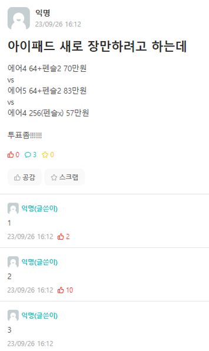
    </td>
    <td style="text-align: center;">
      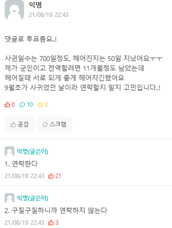
    </td>
  </tr>
</table>

#### 1.3 개발 목표
- 민심캐치 소개 및 목표 설정
  - 민심캐치는 MZ세대를 주요 대상으로 하는 모바일 커뮤니티 웹 앱입니다.
  - 사용자들이 자신의 고민을 공유하고 해결 방안을 모색할 수 있는 플랫폼이며, 투표와 댓글을 통해 피드백을 받을 수 있습니다.
  - 목표는 온라인 상호작용을 증진시키는 것이며, 빠른 피드백과 정서적 지지를 제공합니다.
  - 프로젝트는 디지털 공간의 필요성을 인식하고, 젊은 세대에 맞춤형 서비스를 제공하기 위해 기획되었습니다.

- 민심캐치의 기능과 장점
  - 사용자들이 투표를 통해 의견을 제시하고, 커뮤니티의 피드백을 받을 수 있습니다.
  - 현대 사회에서 개인의 고민을 해결하는 저비용 방법으로 기능합니다.
  - 온라인 상호작용을 선호하는 MZ세대를 대상으로 하며, 사용자들 간의 공감과 지지를 제공합니다.

### 2. 최종결과물 소개  

#### 2.1 로그인, 회원가입, 마이페이지 기능
* "민심캐치"는 중복 투표 방지 및 게시글 관리의 편의를 위해 회원만 서비스를 사용할 수 있습니다. 이를 위해 로그인 기능과, 이메일을 이용한 회원가입을 지원하고, 마이페이지에 접근할 수 있습니다. 회원정보는 FireBase DB에 저장됩니다.

<table>
  <tr>
    <td style="text-align: center;">
      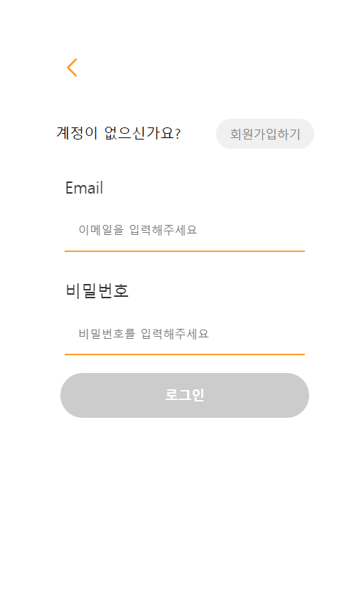
    </td>
    <td style="text-align: center;">
      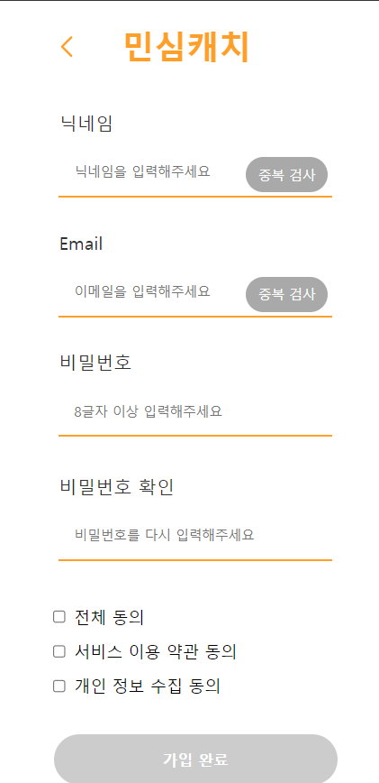
    </td>
    <td style="text-align: center;">
      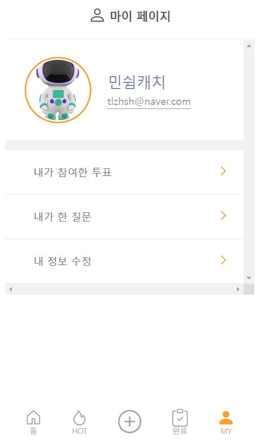
    </td>
  </tr>
</table>

#### 2.2 메인페이지 기능
* 사용자가 로그인 후 제일 처음 접하는 화면으로 현재 투표가 진행중인 게시글을 불러옵니다. 별도의 작업 없이, 사용자는 스크롤을 통해 손쉽게 여러 고민글에 접근할 수 있습니다.

    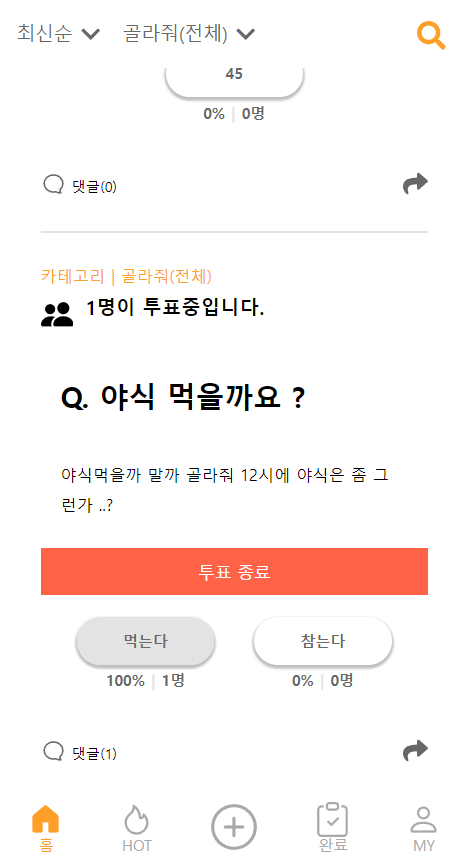

 

#### 2.3 검색 기능 
* 사용자는 특정 키워드를 검색하여 원하는 내용의 게시물에 접근할 수 있습니다. 이를 통해 게시글을 올리지 않고도 내가 원하는 고민이나 비슷한 고민에 대한 해답을 얻을 수 있습니다.

    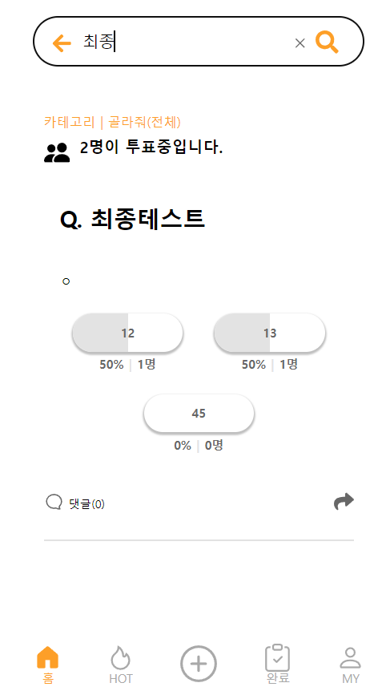

 

#### 2.4 게시글 업로드 기능 
* 사용자는 화면 하단의 "+" 버튼을 눌러 업로드 기능에 접근할 수 있습니다. 질문의 제목과 상세한 설명, 투표 받을 선택지를 자유롭게 추가하여 손쉽고 빠르게 고민 해결을 위한 대안들을 얻을 수 있습니다.

    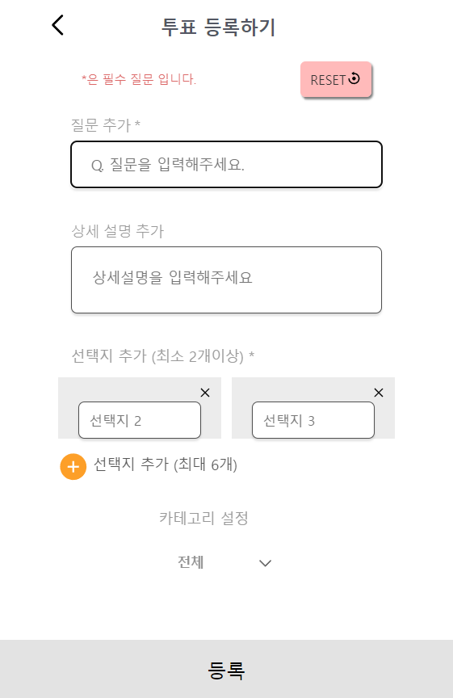

 

#### 2.5 내가 참여한 게시글, 내가 질문한 게시글
* 사용자는 마이페이지 화면에서 내가 참여한 투표와 내가 한 질문에 바로 접근할 수 있습니다. 해당 화면에서는 투표의 진행 여부와 제목을 불러오고 해당 게시글로 연결해줍니다.
<table>
  <tr>
    <td style="text-align: center;">
      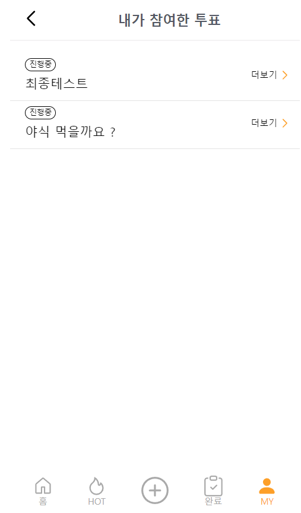
    </td>
    <td style="text-align: center;">
      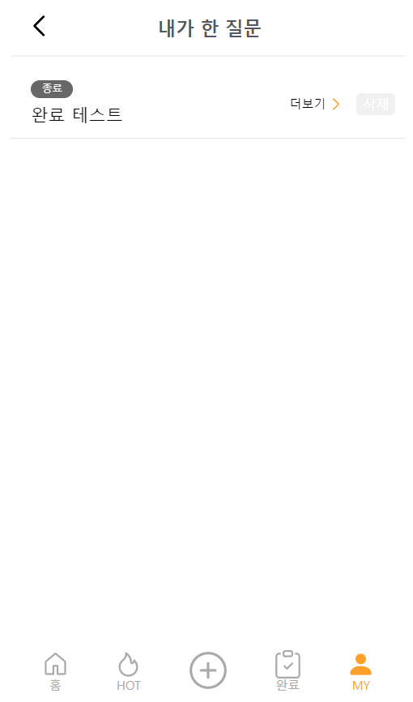
    </td>
  </tr>
</table>

#### 2.6 핫 페이지
* 핫 페이지 기능은 투표가 가장 활발하게 진행되고 있는 게시글을 보여주는 기능입니다. 사용자는 해당 서비스에서 가장 이슈가 되고 있는 고민이 무엇인지 파악할 수 있습니다.

    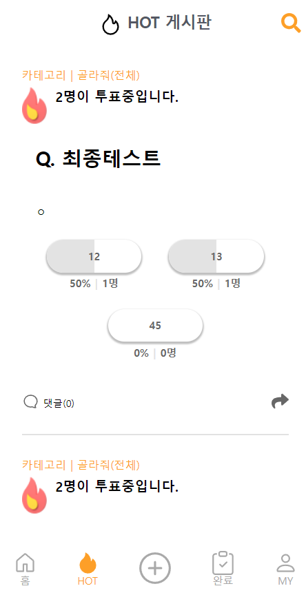

 

### 3. 프로젝트 추진 내용    

#### 3.1 프로젝트 진행과정    

* 전체적인 시스템 구성 
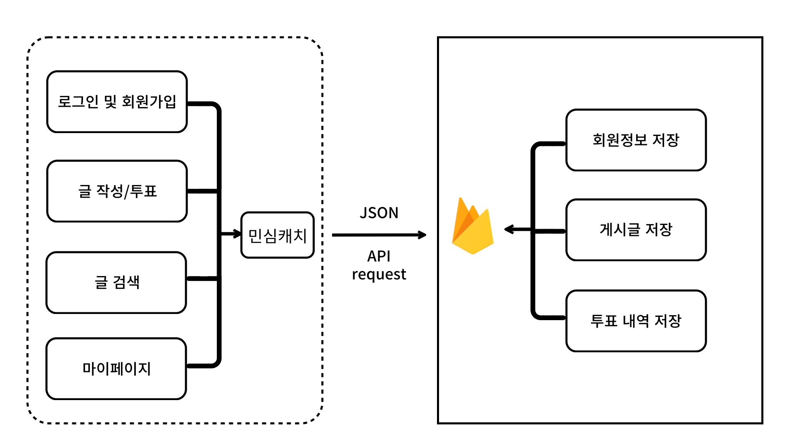

* 순서를 나타내는 블록다이어그램과 데이터베이스 

 
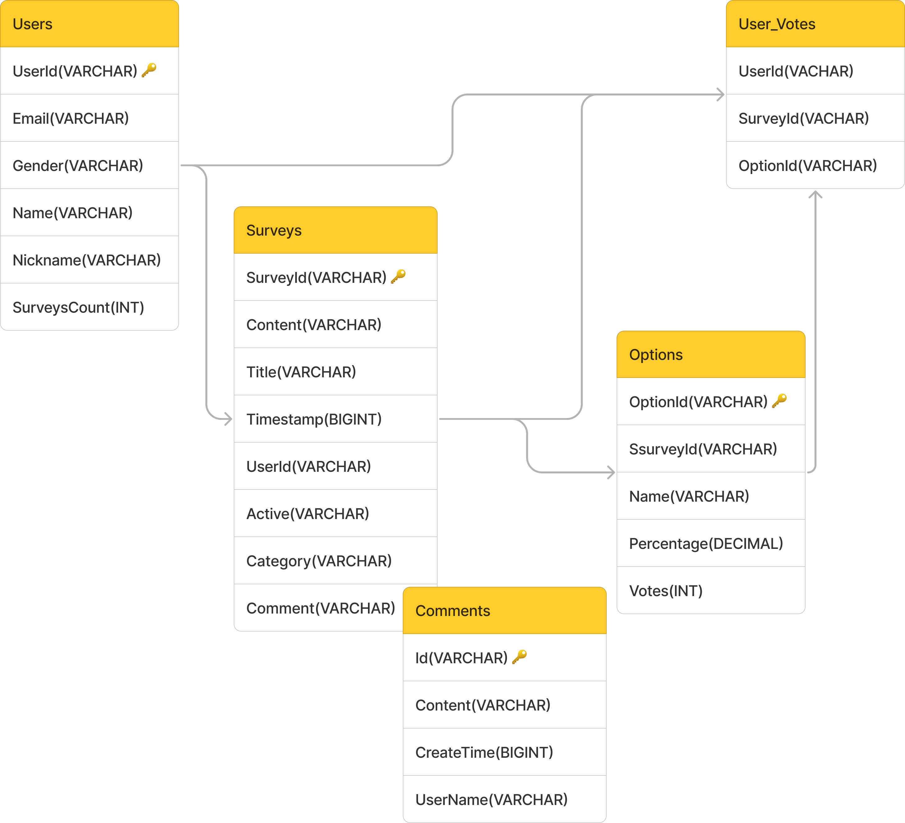

* 개념설계 단계에서 주요 기능인 로그인 및 회원가입, 마이페이지, 글 작성과 투표, 검색 기능등을 구상하였습니다. 기본적으로 모든 데이터 통신은 JSON 파일을 통해 FireBase와 이루어지고 저장됩니다.

* 상세설계 단계에서는 주요 기능과 그로부터 파생된 작은 기능들을 추가하였습니다. 또한 각 정보가 데이터베이스에 저장되는 구조를 설계하고 라우팅하였습니다.
  - 핵심기능의 상세설계
    1. CompletePage : Database에서 완료된 설문조사를 가져와서, 로딩 중에는 로더를 표시하고, 오류가 발생하면 오류 화면을, 데이터가 없으면 해당 페이지를, 데이터가 있으면 설문조사 목록을 렌더링하는 컴포넌트를 정의
    2. HotPage : Database에서 "인기 있는" 설문조사를 가져와, 로딩 중에는 로더를 표시하고, 오류가 발생하면 오류 화면을, 데이터가 없으면 해당 페이지를, 데이터가 있으면 설문조사 목록을 렌더링하는 컴포넌트를 정의
    3. MainPage : Database에서 활성 설문조사를 가져와, 로딩 중에는 로더를 표시하고, 오류가 발생하면 오류 화면을, 데이터가 없으면 해당 페이지를, 데이터가 있으면 설문조사 목록을 렌더링하는 컴포넌트를 정의
    4. Mypage : 사용자가 로그인하지 않았을 때 메인 페이지로 리다이렉션하며, 로그인한 사용자의 프로필 정보를 Database에서 가져옴
       - MyParticipatePage : 사용자가 참여한 투표 목록을 Database에서 불러와서 표시하며, 사용자가 로그인하지 않았을 경우 상태를 관리
       - MyQuestionPage : 사용자가 작성한 질문 목록을 Database에서 불러와서 표시하며, 로그인된 사용자의 정보를 확인하여 해당 사용자의 질문만 필터링
    5. SearchPage : 사용자가 입력한 검색어를 바탕으로 Database에서 설문조사를 검색하여 결과를 표시합니다. 검색 결과가 없으면 적절한 메시지를 보여주고, 로딩 상태를 관리
    6. UploadPage : 사용자가 설문조사를 작성하고 업로드할 수 있는 페이지로, 로그인 여부를 확인하고, 작성 중 페이지 새로고침을 방지하며, 입력된 내용을 초기화할 수 있는 기능을 제공

#### 3.2 프로젝트 구현과정
* 구현 과정에서는 프론트엔드 react , 백엔드는 Firebase를 사용하였습니다.
  - 프론트엔드
    - JSX를 이용해 제공되는 자바스크립투와 HTML을 조합한 문법을 통해 UI 코드를 좀 더 쉽게 작성함
    - 컴포넌트의 구조를 더욱 명확하게 보여주고, 컴포넌트의 렌더링과 관련된 작업을 단순화 함
    - 리코일을 사용하여 리액트 애플리케이션의 전역 상태를 관리
    - 이를 통해 복잡한 상태 관리 로직을 작성할 필요 없이 컴포넌트 간의 데이터 교환
    - 비동기 데이터를 효율적으로 관리하고 갱신할 수 있으며, 갱신된 데이터를 자동으로 컴포넌트에 반영시킴
  - 백엔드 및 데이터 베이스
    - firebase의 RealTimeDatabase라는 저장소를 이용중
    - 실시간 데이터 읽기/쓰기가 가능, 이를 통해 실시간으로 데이터 구조를 변화시키는 것이 가능함
    - 별도의 백엔드 코드를 작성하여 통신으로 프론트엔드와 백엔드를 연결하는 작업이 필요없이 프론트엔드에서 코드를 작성하여 백엔드까지 처리 가능
    - firebase안에는 인증 및 보안을 제공하므로 이를 이용해 간단하게 인증 및 접근 권한 관리가 가능
    
- 설계의 문제점 
  - 마이페이지 - 내가참여한 투표 무한 리로드 됨
    - MyVoteList 컴포넌트에 props를 넘겨줄 때 firebase에서 useEffect를 통해 불러오는 key값과 user의 key값이 서로 중복되어 투표 리스트가 무한 리로드되는 현상이 발생 , 해당 key값을 찾아서 모두 고유key값으로 변경후 해결 완료
  - 모달창에 원하는 데이터를 불러오지 못함
    - 내가 참여한 투표나 내가 작성한 글을 클릭하면 메인페이지의 글 내용이 모달에 나와 해당 글을 보여주도록 초기에 컨셉을 잡았지만 , 메인페이지와 마이페이지를 만들 때 각자 다른 사람이 서로 다른 방식으로 코드를 작성하여 
      파이어베이스에서 서로 다른 정보를 가지고 데이터를 가져오는 바람에 모달에 원하는 정보가 등록 되지 않음
    - 메인페이지에서 데이터를 불러오는 방식을 이용해서 모달에 메인페이지 정보를 가져오도록 수정함

### 4. 기대효과  

#### 1. 자유로운 플랫폼 제공
이 플랫폼은 모든 사용자가 자유롭게 의견을 표현하고 투표할 수 있는 개방형 공간을 제공합니다. 특히 젊은 10~20대 사용자들이 자신의 의견을 쉽게 공유할 수 있게 하여, 주로 가벼운 주제들로 더욱 활발한 참여를 유도합니다.

#### 2. 효율적 의견 수집  
간단하고 직관적인 사용자 인터페이스(UI)를 통해 사용자는 복잡한 절차 없이 원하는 설문을 신속하게 생성하고 공유할 수 있습니다. 이러한 접근성은 신속한 데이터 수집과 함께, 사용자 경험을 극대화합니다.

#### 3. 사회적 상호 작용 증진  
가볍고 일상적인 다양한 주제의 질문을 통해 사용자들은 자연스럽게 서로 의견을 공유하고 토론하게 됩니다. 이는 건강한 커뮤니케이션 환경을 조성하고, 사회적 연결감을 강화하는데 기여하며, 특히 젊은 사용자들에게 매력적인 소통의 창구로서 자리잡을 것이라 생각합니다.  

### 5. 팀원 역할    

구분 | 성명 | 팀내 역할 
:----:|:-----:|-------
팀장 | 최해관 | 프론트엔드
팀원 | 송원종 | 백엔드
팀원 | 이종주 | 프론트엔드      

### 6. 참고문헌  

1. Juno, [Recoil] Recoil 200% 활용하기, https://velog.io/@juno7803/Recoil-Recoil-200-%ED%99%9C%EC%9A%A9%ED%95%98%EA%B8%B0,2021년 4월
2. 미상 , 국민투표, https://peoplevote.co.kr/community?
3. 해리가 그리는 세상 ,유튜브 사진 올리기, 투표 업로드 방법. 커뮤니티 기능!, https://blog.naver.com/haery_kim/222047169754, 2020년7월
4. 푸사장, [인스타그램] 내 스토리 투표 기능 활용법, https://m.blog.naver.com/zxcvb93/221309741225, 2018년6월
 

### 7. 프로젝트 성과    

* https://github.com/CSID-DGU/2024-1-OSSProj-OneCOIN-04

<!-- ### 7. 첨부  

1. OSS 프로젝트 결과보고서 (요약)  
    * 별도 제공된 양식에 작성 후 제출(pdf 형식)  
2. OSS 프로젝트 참여확인서  
    * 별도 제공된 양식에 작성 및 참여자 서명 후 제출(pdf 형식)    
3. 팀구성원이 함께 찍은 사진 1장  
    * jpg파일 별도제출(파일명: eg. Tnn_팀명_팀사진.jpg)  
4. 작품설명용 사진 1~2장  
    * jpg파일 별도 제출(파일명: eg. Tnn_팀명_4_개념설계.jpg)   -->

