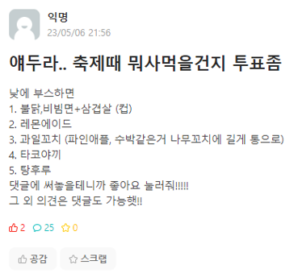

# A3.1 OSS 프로젝트 최종보고서

## I. 프로젝트 수행팀 개요

* 수행 학기:  2024-1학기
* 프로젝트명:  투표 커뮤니티 서비스 "민심캐치(MinsimCatch)"
* Key Words
    * 투표
    * 공감
    * 고민
    * 커뮤니티
    * 단합
* 팀명: OneCOIN

구분 | 성명 | 학번 | 소속학과 | 연계전공 | 이메일
------|-------|-------|-------|-------|-------
팀장 | 최해관 | 2019110026 | 불교학부 | 융합SW연계전공 | kkhagwan@dongguk.edu         
팀원 | 송원종 | 2018110398 | 철학과 | 융합SW연계전공 | wjsong96@dgu.ac.kr       
팀원 | 이종주 | 2021112456 | 산업시스템공학과 | 융합SW연계전공 | tlzhsh2@dgu.ac.kr   

* 지도교수: SW융합교육원 이길섭, 박효순       

## II. 프로젝트  수행 결과

### 1. 프로젝트 개요  

#### 1.1 개발 동기 및 목적  
- 고민 내면화와 디지털 공간의 필요성
  - 현대 사회에서 많은 사람들이 개인적인 고민을 내면화하거나 해결 방법을 찾지 못하는 경우가 많습니다.
  - 기존의 상담 서비스는 대면이나 비용 문제로 접근성이 제한적일 수 있으며, 가벼운 내용일 경우 다수의 의견이 빠르게 필요할 수 있습니다.
  - 이러한 배경에서 저비용으로 손쉽게 접근할 수 있는 디지털 공간의 필요성이 대두되었습니다.
  
- MZ세대와 온라인 공간의 선호
  - 특히 MZ세대는 오프라인 공간보다 온라인 공간을 선호하며, 보다 더 많은 시간을 쏟는 것으로 알려져 있습니다.
  - 이 프로젝트는 사용자들이 온라인 공간에서 자신의 고민을 공유하고, 커뮤니티의 피드백을 통해 다양한 해결책을 모색할 수 있는 플랫폼을 제공합니다.

#### 1.2 필요성  
- 여러 커뮤니티를 조사 했을 때 투표를 해달라는 글이 상당수 존재
  - 커뮤니티에 투표라는 키워드로 검색 했을 때 투표만을 원하는 글들이 상당히 많았다.
## 투표 조사 이미지

<table>
  <tr>
    <td style="text-align: center;">
      
    </td>
    <td style="text-align: center;">
      
    </td>
    <td style="text-align: center;">
      
    </td>
  </tr>
</table>

#### 1.3 개발 목표
- 민심캐치 소개 및 목표 설정
  - 민심캐치는 MZ세대를 주요 대상으로 하는 모바일 커뮤니티 웹 앱입니다.
  - 사용자들이 자신의 고민을 공유하고 해결 방안을 모색할 수 있는 플랫폼이며, 투표와 댓글을 통해 피드백을 받을 수 있습니다.
  - 목표는 온라인 상호작용을 증진시키는 것이며, 빠른 피드백과 정서적 지지를 제공합니다.
  - 프로젝트는 디지털 공간의 필요성을 인식하고, 젊은 세대에 맞춤형 서비스를 제공하기 위해 기획되었습니다.

- 민심캐치의 기능과 장점
  - 사용자들이 투표를 통해 의견을 제시하고, 커뮤니티의 피드백을 받을 수 있습니다.
  - 현대 사회에서 개인의 고민을 해결하는 저비용 방법으로 기능합니다.
  - 온라인 상호작용을 선호하는 MZ세대를 대상으로 하며, 사용자들 간의 공감과 지지를 제공합니다.

### 2. 최종결과물 소개  

#### 2.1 로그인, 회원가입, 마이페이지 기능
* "민심캐치"는 중복 투표 방지 및 게시글 관리의 편의를 위해 회원만 서비스를 사용할 수 있습니다. 이를 위해 로그인 기능과, 이메일을 이용한 회원가입을 지원하고, 마이페이지에 접근할 수 있습니다. 회원정보는 FireBase DB에 저장됩니다.

<table>
  <tr>
    <td style="text-align: center;">
      
    </td>
    <td style="text-align: center;">
      
    </td>
    <td style="text-align: center;">
      
    </td>
  </tr>
</table>

#### 2.2 메인페이지 기능
* 사용자가 로그인 후 제일 처음 접하는 화면으로 현재 투표가 진행중인 게시글을 불러옵니다. 별도의 작업 없이, 사용자는 스크롤을 통해 손쉽게 여러 고민글에 접근할 수 있습니다.

    

 

#### 2.3 검색 기능 
* 사용자는 특정 키워드를 검색하여 원하는 내용의 게시물에 접근할 수 있습니다. 이를 통해 게시글을 올리지 않고도 내가 원하는 고민이나 비슷한 고민에 대한 해답을 얻을 수 있습니다.

    

 

#### 2.4 게시글 업로드 기능 
* 사용자는 화면 하단의 "+" 버튼을 눌러 업로드 기능에 접근할 수 있습니다. 질문의 제목과 상세한 설명, 투표 받을 선택지를 자유롭게 추가하여 손쉽고 빠르게 고민 해결을 위한 대안들을 얻을 수 있습니다.

    

 

#### 2.5 내가 참여한 게시글, 내가 질문한 게시글
* 사용자는 마이페이지 화면에서 내가 참여한 투표와 내가 한 질문에 바로 접근할 수 있습니다. 해당 화면에서는 투표의 진행 여부와 제목을 불러오고 해당 게시글로 연결해줍니다.
<table>
  <tr>
    <td style="text-align: center;">
      
    </td>
    <td style="text-align: center;">
      
    </td>
  </tr>
</table>

#### 2.6 핫 페이지
* 핫 페이지 기능은 투표가 가장 활발하게 진행되고 있는 게시글을 보여주는 기능입니다. 사용자는 해당 서비스에서 가장 이슈가 되고 있는 고민이 무엇인지 파악할 수 있습니다.

    

 

### 3. 프로젝트 추진 내용    

#### 3.1 프로젝트 진행과정    

* 해당항목은 추후 디렉토리 및 보도자료로 활용 예정이오니 상세하고 쉽게 작성한다.     

#### 3.2 프로젝트 구현과정    

* 개념설계 / 상세설계 / 구현 이론 등 문제 해결 방안 및 과정 설명  
    그림과 표의 하단 및 상단에 제목을 기입한다.  
* 개념설계

* 상세설계

 

* 개념설계 단계에서 주요 기능인 로그인 및 회원가입, 마이페이지, 글 작성과 투표, 검색 기능등을 구상하였습니다. 기본적으로 모든 데이터 통신은 JSON 파일을 통해 FireBase와 이루어지고 저장됩니다.

* 상세설계 단계에서는 주요 기능과 그로부터 파생된 작은 기능들을 추가하였습니다. 또한 각 정보가 데이터베이스에 저장되는 구조를 설계하고 라우팅하였습니다.

* 구현 단계에서 프론트엔드는 react 기반, 백엔드는 FireBase를 사용하였고 Notion을 통해 이슈 관리를 진행하였습니다.

### 4. 기대효과  

#### 4.1 자유로운 플랫폼 제공
이 플랫폼은 모든 사용자가 자유롭게 의견을 표현하고 투표할 수 있는 개방형 공간을 제공합니다. 특히 젊은 10~20대 사용자들이 자신의 의견을 쉽게 공유할 수 있게 하여, 주로 가벼운 주제들로 더욱 활발한 참여를 유도합니다.

#### 4.2 효율적 의견 수집  
간단하고 직관적인 사용자 인터페이스(UI)를 통해 사용자는 복잡한 절차 없이 원하는 설문을 신속하게 생성하고 공유할 수 있습니다. 이러한 접근성은 신속한 데이터 수집과 함께, 사용자 경험을 극대화합니다.

#### 4.3 사회적 상호 작용 증진  
가볍고 일상적인 다양한 주제의 질문을 통해 사용자들은 자연스럽게 서로 의견을 공유하고 토론하게 됩니다. 이는 건강한 커뮤니케이션 환경을 조성하고, 사회적 연결감을 강화하는데 기여하며, 특히 젊은 사용자들에게 매력적인 소통의 창구로서 자리잡을 것이라 생각합니다.  

### 5. 팀원 역할    

구분 | 성명 | 팀내 역할 
:----:|:-----:|-------
팀장 | 최해관 | 프론트엔드
팀원 | 송원종 | 백엔드
팀원 | 이종주 | 프론트엔드      

### 6. 참고문헌  

1. 저자, 제목, 교과목, ㅇㅇ대학, 연월.  
2. 저자, 제목, 출판사, 연월.
2. 저자, 제목, 저널명, 권, 호, 연월, 페이지.
3. 저자, 제목, 사이트/블로그명, 링크, 연월.  

### 7. 프로젝트 성과    

* Guthub 등록 / SW 등록 / 논문 / 특허 등 성과를 구체적으로 기재  

### 7. 첨부  

1. OSS 프로젝트 결과보고서 (요약)  
    * 별도 제공된 양식에 작성 후 제출(pdf 형식)  
2. OSS 프로젝트 참여확인서  
    * 별도 제공된 양식에 작성 및 참여자 서명 후 제출(pdf 형식)    
3. 팀구성원이 함께 찍은 사진 1장  
    * jpg파일 별도제출(파일명: eg. Tnn_팀명_팀사진.jpg)  
4. 작품설명용 사진 1~2장  
    * jpg파일 별도 제출(파일명: eg. Tnn_팀명_4_개념설계.jpg)  

