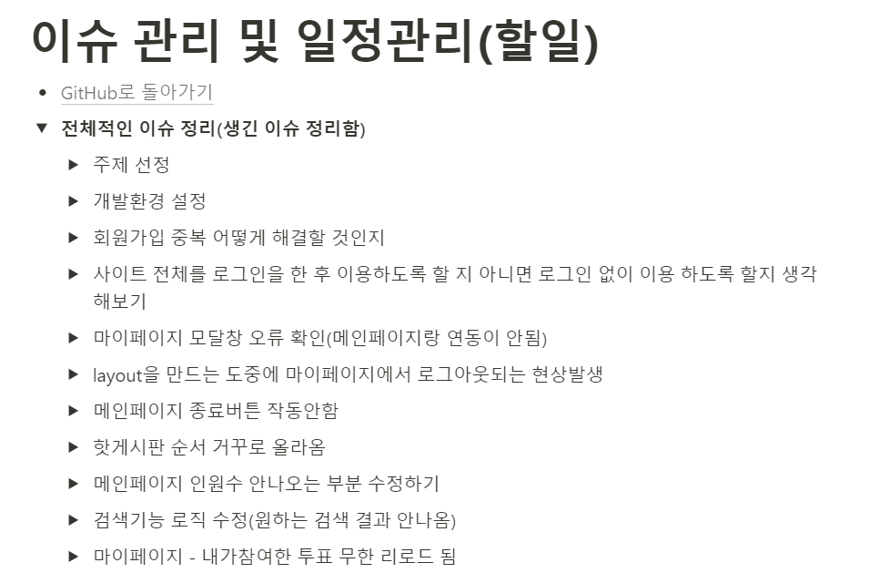

# A4.1 프로젝트 범위 / 일정 / 이슈 관리  

## 범위 관리
## 기능 구현 현황([범위 관리 바로가기](https://docs.google.com/spreadsheets/d/1D23VCFfzl1AauwCncltuhI9Hdxy8iGv5-24Mk3LrgCk/edit#gid=1386834576))

| 구현여부 |  | 기능 | 구현 상세 설명 | 연결된 컴포넌트 |
|----------|------|------|----------------|-----------------|
| 100% |신규작성| 로그인 | 로그인 기능 | Src/minsimcatch/src/pages/login/LoginPage.jsx |
| 100% |신규작성| 핫 게시물 | 투표가 많이 되어있는 글을 보여줌 | Src/minsimcatch/src/pages/hot/HotPage.jsx |
| 100% |신규작성| 완료된 게시물 | 투표를 완료한(종료한) 글을 보여줌 | Src/minsimcatch/src/pages/complete/CompletePage.jsx |
| 100% |신규작성| 마이 페이지 | 투표 내역, 작성한 글, 정보 수정 화면을 보여줌 | Src/minsimcatch/src/pages/my/Mypage.jsx |
| 100% |신규작성| 메인 페이지 | 로그인하면 보이는 페이지(질문 글들이 보임) | Src/minsimcatch/src/pages/main/MainPage.jsx |
| 100% |신규작성| 검색 | 키워드로 글을 검색할 수 있음 | Src/minsimcatch/src/pages/serach/SearchPage.jsx |
| 100% |신규작성| 회원가입 | 회원가입 기능 | Src/minsimcatch/src/pages/signup/SignUpPage.jsx |
| 100% |신규작성| 업로드 | 글을 작성해 업로드 하는 기능 | Src/minsimcatch/src/pages/upload/UploadPage.jsx |
| 100% |신규작성| 댓글 | 모달을 통해 댓글을 작성하는 기능 | Src/minsimcatch/src/components/common/modal/ChatFrom.jsx |
| X || 내 프로필이미지 | 마이페이지에서 내 프로필 사진 변경 | 사유 : 초기에 개발을 하지 못해 데이터구조가 복잡해져 시간이슈로 시도하다 실패함 |
| 100% |신규작성| 투표 종료 | 투표 종료를 눌러 더 이상 투표를 하지 못하도록 설정 | Src/minsimcatch/src/components/common/VoteButton/EndButton.jsx |
| 100% |신규작성| 내가 투표한 게시물 | 내가 투표한 게시물의 리스트를 보여줌 | Src/minsimcatch/src/pages/my/MyParticipatePage.jsx |
| 100% |신규작성| 내가 작성한 글 | 내가 작성한 글의 리스트를 보여줌 | Src/minsimcatch/src/pages/my/MyQuestionPage.jsx |
## 일정 관리
### Gantt 차트 활용
- **목적**: 프로젝트의 전체 범위와 일정을 시각적으로 관리하여, 각 팀원이 프로젝트의 진행 상황을 쉽게 파악할 수 있도록 합니다.
- **도구**: Gantt 차트를 사용하여 중요한 마일스톤과 각 작업의 예상 시작 및 종료 날짜를 표시합니다.
.png)

### 상세 일정
- **5월 이후 계획**
  - **프론트엔드**:
    - **주요 작업**: 데이터베이스에 저장된 설문 객체들을 불러오는 메인 페이지 구성.
    - **추가 작업**: 메인 페이지를 기반으로 인기 투표 및 완료된 투표 페이지 등을 구성할 예정입니다.
  - **백엔드**:
    - **주요 작업**: 업로드되는 투표 객체의 데이터 구조를 세분화.
    - **목적**: 세분화된 데이터 구조를 통해 다양한 프론트엔드 페이지에서 데이터를 효과적으로 불러올 수 있도록 지원합니다.

- **6월 이후 계획**
  - **프론트엔드**:
    - **주요 작업**: 필수적인 모든 기능(메인,투표,핫게시물,완료게시물,업로드,마이페이지)을 구현하였고 해당 기능들이 잘 작동하는지 테스트 진행
    - **목 적**: 해당 기능을 이용하면서 최종 시연 때 생길만한 오류를 미리 해결하기 위함
  - **백엔드**:
    - **주요 작업**: 파이어베이스에 데이터는 정상적으로 올라가지는 것을 확인했고 해당 데이터들이 잘 정리되어 저장되도록 마지막으로 데이터 구조를 정리 할 예정
    - **목적**: 데이터를 불러올 때 파이어베이스와의 연동이 미흡해 무한 재호출을 하는 경우가 생겨 그것을 해결하기 위함

## 이슈 관리 및 커뮤니케이션 도구 활용

### 프로젝트 이슈 지속적 관리
- **GitHub**: 모든 프로젝트 관련 이슈를 GitHub에서 관리하여 팀원 모두가 이슈의 상태와 업데이트를 쉽게 확인할 수 있습니다.
- **이슈 트래킹**: 이슈가 보고되면 적절한 라벨과 마일스톤을 지정하여 우선순위와 진행 상태를 관리합니다.
- **Notion**: 개발을 하는 동안 발생했던 이슈를 모두 정리하고 개발내용 및 일정을 관리합니다.

### 카카오톡 및 슬랙을 이용한 커뮤니케이션
- **카카오톡**: 긴급한 문제 해결이 필요할 때 빠른 의사소통을 위해 사용합니다.
- **슬랙**: 프로젝트 관련 일반적인 논의, 이슈에 대한 빠른 피드백 및 업데이트 공유에 사용합니다.
  - 슬랙 내에 GitHub 앱을 연동하여, GitHub의 이슈 업데이트를 슬랙 채널에 자동으로 알림받을 수 있습니다. 이를 통해 팀원들이 이슈의 최신 상태를 실시간으로 확인할 수 있습니다.

### 도구 연동
- **도구 연동의 부재**: 현재 별도의 프로젝트 관리 도구를 사용하고 있지 않으며, 이슈 관리는 GitHub를 중심으로 수행하고 있습니다.
  - 필요 시 프로젝트 관리 도구를 도입하는 것을 고려할 수 있으며, 이 경우 도구 선택과 통합 방법에 대해 논의할 필요가 있습니다.

## 이슈 내역

- 자세한 이슈 관리 내역은 현재 Notion을 활용해 관리중입니다(
[이슈 관리 바로가기](https://clammy-feverfew-32d.notion.site/44d92fb9924f4a839955138a6b1ccc62?pvs=4))

  

- [메인페이지로 돌아가기](https://github.com/CSID-DGU/2024-1-OSSProj-OneCOIN-04)
