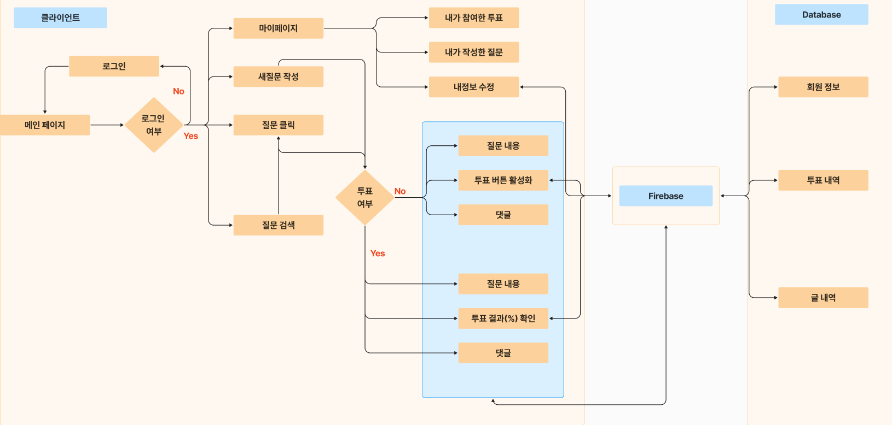

# A4.3 OSS 프로젝트 제품 구성, 배포 및 운영 자료  

- *자료 내용이 길어지는 경우 별도 문서로 작성하고 링크로 연결*

## 1. 프로젝트 제품 구성

 

| 구현여부 |  | 기능 | 구현 상세 설명 | 연결된 컴포넌트 |
|----------|------|------|----------------|-----------------|
| 100% |신규작성| 로그인 | 로그인 기능 | Src/minsimcatch/src/pages/login/LoginPage.jsx |
| 100% |신규작성| 핫 게시물 | 투표가 많이 되어있는 글을 보여줌 | Src/minsimcatch/src/pages/hot/HotPage.jsx |
| 100% |신규작성| 완료된 게시물 | 투표를 완료한(종료한) 글을 보여줌 | Src/minsimcatch/src/pages/complete/CompletePage.jsx |
| 100% |신규작성| 마이 페이지 | 투표 내역, 작성한 글, 정보 수정 화면을 보여줌 | Src/minsimcatch/src/pages/my/Mypage.jsx |
| 100% |신규작성| 메인 페이지 | 로그인하면 보이는 페이지(질문 글들이 보임) | Src/minsimcatch/src/pages/main/MainPage.jsx |
| 100% |신규작성| 검색 | 키워드로 글을 검색할 수 있음 | Src/minsimcatch/src/pages/serach/SearchPage.jsx |
| 100% |신규작성| 회원가입 | 회원가입 기능 | Src/minsimcatch/src/pages/signup/SignUpPage.jsx |
| 100% |신규작성| 업로드 | 글을 작성해 업로드 하는 기능 | Src/minsimcatch/src/pages/upload/UploadPage.jsx |
| 100% |신규작성| 댓글 | 모달을 통해 댓글을 작성하는 기능 | Src/minsimcatch/src/components/common/modal/ChatFrom.jsx |
| 100% |신규작성| 투표 종료 | 투표 종료를 눌러 더 이상 투표를 하지 못하도록 설정 | Src/minsimcatch/src/components/common/VoteButton/EndButton.jsx |
| 100% |신규작성| 내가 투표한 게시물 | 내가 투표한 게시물의 리스트를 보여줌 | Src/minsimcatch/src/pages/my/MyParticipatePage.jsx |
| 100% |신규작성| 내가 작성한 글 | 내가 작성한 글의 리스트를 보여줌 | Src/minsimcatch/src/pages/my/MyQuestionPage.jsx |
  
## 2. 프로젝트 제품 배포 방법  
- 배포를 따로 진행하지 않음

## 3. 프로젝트 제품 운영 방법  
- 프로젝트 실행 방법
```
☆실행방법☆

npm install

npm run dev
```
- 프로젝트 시연 시나리오


- 위 시퀀스 다이어그램처럼 글작성, 투표 진행 후 해당 투표와 글작성이 잘 이루어졌는지 마이페이지에서 투표목록 및 글작성 내역 확인


<hr>

- [메인페이지로 돌아가기](https://github.com/CSID-DGU/2024-1-OSSProj-OneCOIN-04)