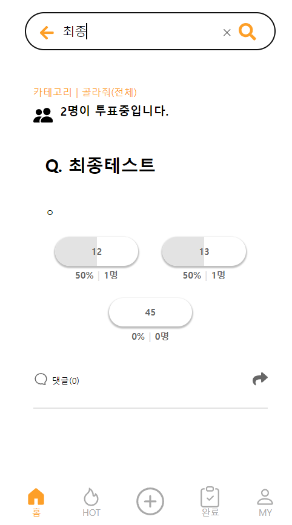

# 프로젝트 이름

민심캐치

## 사용된 오픈소스 라이브러리

이 프로젝트는 다음과 같은 오픈소스 라이브러리를 사용하고 있습니다:

- [styled-components](https://github.com/styled-components/styled-components) - MIT License
- [React Icons](https://github.com/react-icons/react-icons) - MIT License
- [Recoil](https://github.com/facebookexperimental/Recoil) - MIT License
- [React Router DOM](https://github.com/remix-run/react-router) - MIT License
- [SweetAlert2](https://github.com/sweetalert2/sweetalert2) - MIT License
- [PropTypes](https://github.com/facebook/prop-types) - MIT License
- [@mui/icons-material](https://github.com/mui/material-ui/tree/master/packages/mui-icons-material) - MIT License
- [tanstack/react-query](https://github.com/TanStack/query) - MIT License
- [badwords-ko](https://github.com/gon125/badwords-ko) - MIT License

## 라이센스

이 프로젝트는 MIT 라이센스를 따릅니다. 

### 최종 결과물([주요 페이지 소스코드 바로가기](https://github.com/CSID-DGU/2024-1-OSSProj-OneCOIN-04/tree/main/Src/minsimcatch/src/pages))

### 전체 시스템 구성도
 

### 로그인 및 회원가입(신규 작성)
- 로그인 : Src/minsimcatch/src/pages/login/loginPage.jsx
- 회원가입 : Src/minsimcatch/src/pages/signup/SignUpPage.jsx
<table>
  <tr>
    <td style="text-align: center;">
      
로그인

      
    </td>
    <td style="text-align: center;">
      
회원가입

      
    </td>
  </tr>
</table>

### 메인 페이지 및 글작성(신규 작성)
- 메인페이지 : Src/minsimcatch/src/pages/main/MainPage.jsx
- 글작성 : Src/minsimcatch/src/pages/upload/UploadPage.jsx
<table>
  <tr>
    <td style="text-align: center;">
      
메인 페이지

      
    </td>
    <td style="text-align: center;">
      
글작성

      
    </td>
  </tr>
</table>

### 핫 페이지 및 완료 페이지(신규 작성)
- 핫 페이지 : Src/minsimcatch/src/pages/hot/HotPage.jsx
- 완료 페이지 : Src/minsimcatch/src/pages/complete/CompletePage.jsx
<table>
  <tr>
    <td style="text-align: center;">
      
핫 페이지

      
    </td>
    <td style="text-align: center;">
      
완료 페이지

      
    </td>
  </tr>
</table>

### 마이 페이지 및 검색 페이지(신규 작성)
- 마이페이지 : Src/minsimcatch/src/pages/my/Mypage.jsx
- 검색페이지 : Src/minsimcatch/src/pages/serach/SearchPage.jsx
<table>
  <tr>
    <td style="text-align: center;">
      
마이 페이지

      
    </td>
    <td style="text-align: center;">
      
검색 페이지

      
    </td>
  </tr>
</table>

### 내가 참여한 투표 및 내가 작성한 글(신규 작성)
- 내가 참여한 투표 : Src/minsimcatch/src/pages/my/MyParticipatePage.jsx
- 내가 작성한 글 : Src/minsimcatch/src/pages/my/MyQuestionPage.jsx
<table>
  <tr>
    <td style="text-align: center;">
      
내가 참여한 투표

      
    </td>
    <td style="text-align: center;">
      
내가 작성한 글

      
    </td>
  </tr>
</table>

## 기능 구현 현황([주요 페이지 소스코드 바로가기](https://github.com/CSID-DGU/2024-1-OSSProj-OneCOIN-04/tree/main/Src/minsimcatch/src/pages))

| 구현여부 |  | 기능 | 구현 상세 설명 | 연결된 컴포넌트 |
|----------|------|------|----------------|-----------------|
| 100% |신규작성| 로그인 | 로그인 기능 | Src/minsimcatch/src/pages/login/LoginPage.jsx |
| 100% |신규작성| 핫 게시물 | 투표가 많이 되어있는 글을 보여줌 | Src/minsimcatch/src/pages/hot/HotPage.jsx |
| 100% |신규작성| 완료된 게시물 | 투표를 완료한(종료한) 글을 보여줌 | Src/minsimcatch/src/pages/complete/CompletePage.jsx |
| 100% |신규작성| 마이 페이지 | 투표 내역, 작성한 글, 정보 수정 화면을 보여줌 | Src/minsimcatch/src/pages/my/Mypage.jsx |
| 100% |신규작성| 메인 페이지 | 로그인하면 보이는 페이지(질문 글들이 보임) | Src/minsimcatch/src/pages/main/MainPage.jsx |
| 100% |신규작성| 검색 | 키워드로 글을 검색할 수 있음 | Src/minsimcatch/src/pages/serach/SearchPage.jsx |
| 100% |신규작성| 회원가입 | 회원가입 기능 | Src/minsimcatch/src/pages/signup/SignUpPage.jsx |
| 100% |신규작성| 업로드 | 글을 작성해 업로드 하는 기능 | Src/minsimcatch/src/pages/upload/UploadPage.jsx |
| 100% |신규작성| 댓글 | 모달을 통해 댓글을 작성하는 기능 | Src/minsimcatch/src/components/common/modal/ChatFrom.jsx |
| X || 내 프로필이미지 | 마이페이지에서 내 프로필 사진 변경 | 사유 : 초기에 개발을 하지 못해 데이터구조가 복잡해져 시간이슈로 시도하다 실패함 |
| 100% |신규작성| 투표 종료 | 투표 종료를 눌러 더 이상 투표를 하지 못하도록 설정 | Src/minsimcatch/src/components/common/VoteButton/EndButton.jsx |
| 100% |신규작성| 내가 투표한 게시물 | 내가 투표한 게시물의 리스트를 보여줌 | Src/minsimcatch/src/pages/my/MyParticipatePage.jsx |
| 100% |신규작성| 내가 작성한 글 | 내가 작성한 글의 리스트를 보여줌 | Src/minsimcatch/src/pages/my/MyQuestionPage.jsx |
